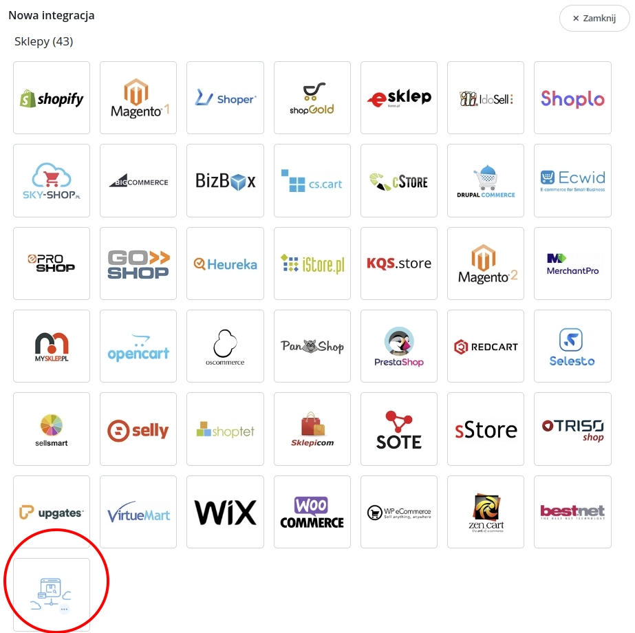
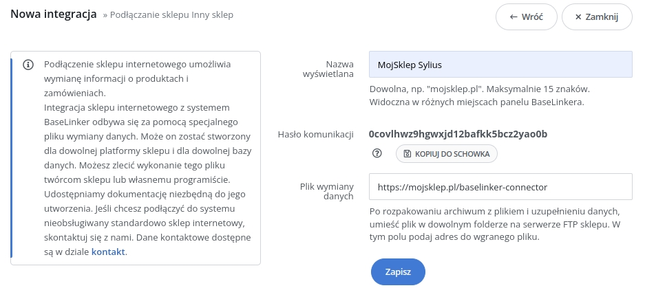

[](https://spinbits.io)
# Sylius Baselinker Plugin

## Overview

This plugin is used to connect Sylius and Baselinker. Baselinker can be used as an integrator and management platform for your e-commerce.
It allows to offer your products on many platforms like Ebay, Amazon or Allegro.
Baselinker can help you automate sale processes with almost 16000 different providers.

## Details
This package is implementation of communication with BaseLinker Connector ("integration file"). 
For further details please refer to https://developers.baselinker.com/shops_api/ 

After installation your Baselinker connector url will be available under path: `/baselinker-connector` of your shop.

## Baselinker Configuration

1. Login to your Baselinker account: https://login.baselinker.com/
2. Click integrations: https://panel-b.baselinker.com/list_integrations.php
    
3. Configure your integration as showed below. Remember to replace your shop domain in url.
    
4. Copy communication password and set it your `.env` file as showed below:
    `BASELINKER_PASSWORD='example-password-change-it'`

## Sylius Quickstart Installation

Follow the steps to install the plugin on your Sylius application:

1. Run `composer require spinbits/sylius-baselinker-plugin`.

2. Import route into your routing file:

    ```
    spinbits_baselinker_plugin:
        resource: "@SpinbitsSyliusBaselinkerPlugin/Resources/config/admin_routing.yml"
    ```

3. Import trait to your Order entity: `src/Entity/Order/Order.php`
    ```
    use Spinbits\SyliusBaselinkerPlugin\Entity\Order\OrderTrait;
    
    class Order extends BaseOrder
    {
        use OrderTrait;
    
    ```

4. Set Baselinker password: `.env`
    ```
    BASELINKER_PASSWORD='example-password'
    ```
5. Imports Plugin XML config file:
    ```
        <imports>
            <import resource="@SpinbitsSyliusBaselinkerPlugin/Resources/services.xml"/>
        </imports>
    ```            
   Or in `config/services.yaml`:
   ```yaml
    imports:
        - { resource: '../vendor/spinbits/sylius-baselinker-plugin/src/Resources/config/services.xml' }
   ```
6. Run migrations:
    `bin/console doctrine:migrations:migrate`

## Test plugin:

### Basic tests

in order to test plugin you should 
- replace `localhost` with your sylius domain 
- replace `example-password` with your baselinker password
    
You may get supported methods:
    
`curl -X POST -d 'bl_pass=example-password&action=SupportedMethods' http://localhost/baselinker-connector`
    
You may get version of integration:
    
`curl -X POST -d 'bl_pass=example-password&action=FileVersion' http://localhost/baselinker-connector`
        
### Using Baslinker tester
go to: 
    `https://developers.baselinker.com/shops_api/index.php?tester=1`     
and follow the instructions.

## Help
If you need some help with Sylius development, don't hesitate to contact us directly. You can send us an email at office@spinbits.io

